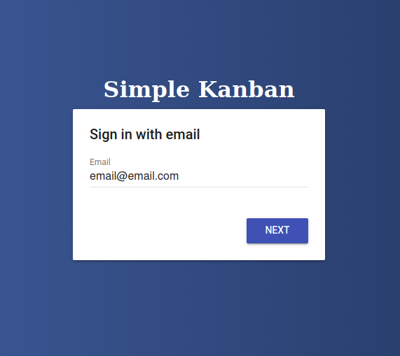
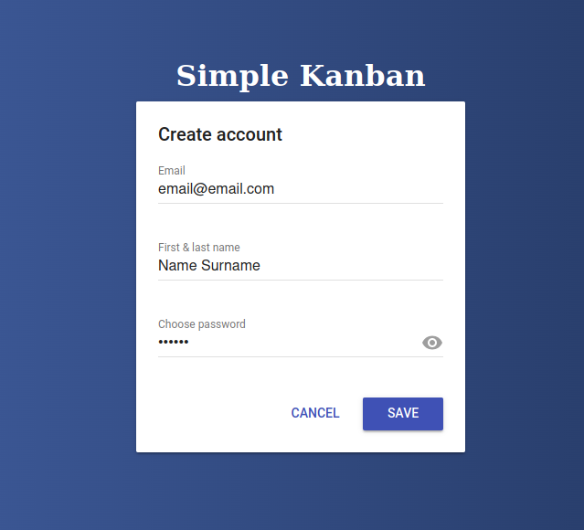
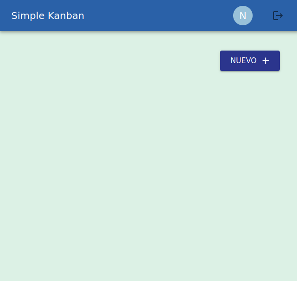
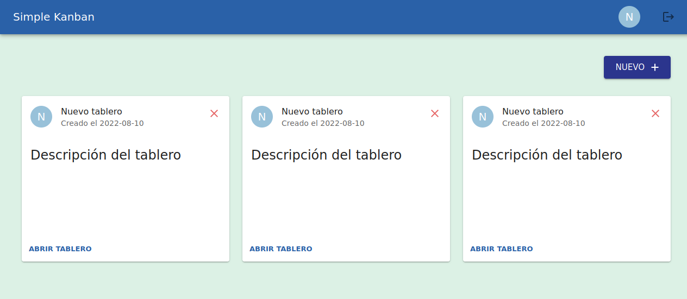
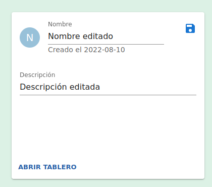
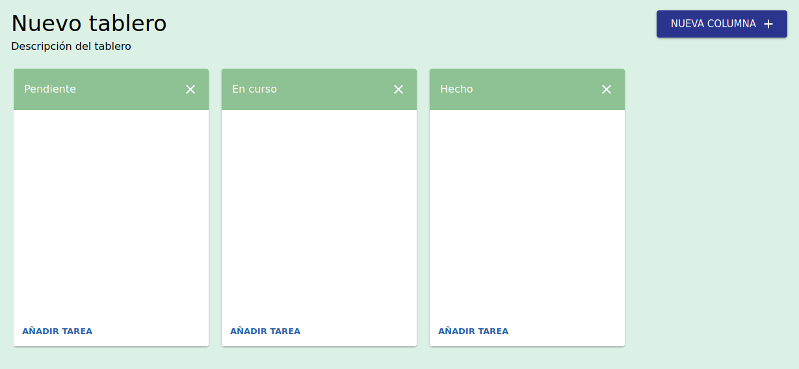
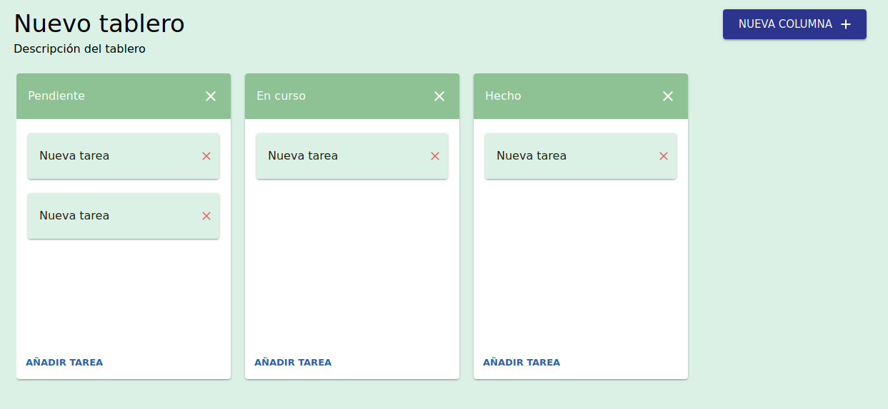
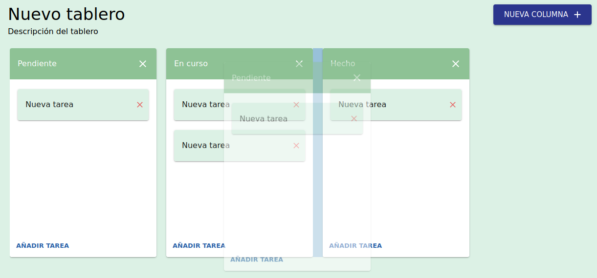
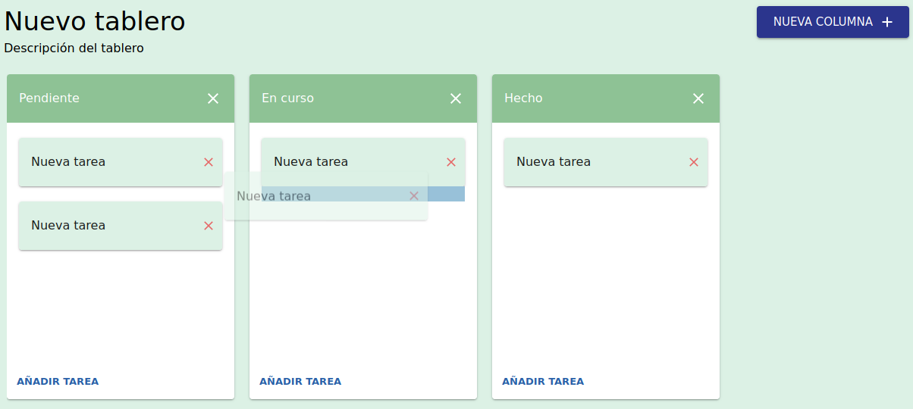

# Simple Kanban

## About this project

### What is it?

A very simple web application, where you will be able to create boards containing columns, each column containing tasks. It is perfect to apply the *Kanban* management method.

### Purpose

Created as a practice in the context of the [GeeksHubs Academy's Frontend React Developer](https://geekshubsacademy.com/producto/frontend-react/) Bootcamp.

## Overview

### Features briefing

This is what is included:

* **Sign up and sign in with email and password**. You can create as many users as needed and login into the application with a specific user.
* **Available in English and Spanish**. Language is auto-detected from the browser.
* **Create boards with title and description**. Create as many boards as required.
* **Create columns with a name**. Create as many columns as required within a board and reorder them.
* **Create tasks with a description**. Create as many tasks as required and reorder them (within a column or between columns).

### Main dependencies

In this section the main dependencies of this project are highlighted.

| Package                                                      | Purpose                                                      |
| ------------------------------------------------------------ | ------------------------------------------------------------ |
| [@mui/material](https://www.npmjs.com/package/@mui/material) | A library of *React UI* components used to build the interface. |
| [redux](https://www.npmjs.com/package/redux) [react-redux](https://www.npmjs.com/package/react-redux) | A library used to apply a pattern to manage the state of the application in a centralized way, instead of creating an individual state for each component. |
| [react-router-dom](https://www.npmjs.com/package/react-router-dom) | A routing library used to configure the navigation within the application without reloads |
| [i18next](https://www.npmjs.com/package/i18next) [i18next-browser-languagedetector](https://www.npmjs.com/package/i18next-browser-languagedetector) | A framework used for internationalization. This way the application can be displayed in Spanish or English, depending on the language detected in the browser. |
| [firebase](https://www.npmjs.com/package/firebase)           | Used to access the *Cloud Firestore*, which provides a No-SQL cloud database. This way all the information introduced in the application can be saved without the need of a backend. |
| [react-firebaseui](https://www.npmjs.com/package/react-firebaseui) | A wrapper used to easily include the sign-up and sign-in view over the *FirebaseUI Auth* utility |
|                                                              |                                                              |

### How the application looks

Follow these steps to test the application:

1. If you don't want to sign up, you can sign in with this available credentials [here](https://laura-simple-kanban.herokuapp.com/login).

   ``user: laura@test.com``

   ``password: 123456``

2. You can **sign up** by entering your email address and preferred password [here](https://laura-simple-kanban.herokuapp.com/login).

   

   

3. In the home view, you can **create new boards** by clicking on the *New* button. You can always **return to the home view** by clicking in the application name located to the left of the header bar. To the right of the header bar, there is a button to **sign out**.

   

4. All existing boards are displayed in this view. In order to **delete a board**, you must click on the cross icon button. To **edit the name and description** of a board, just click on the corresponding label. To **open the board**, click on the *Open board* button at the bottom of the board card.

1. Once the board is opened, you can **create new columns** by clicking on the *New column* button. In order to **delete a column**, you must click on the cross icon button close to the column name. You can **edit the name** of a column by clicking on the corresponding label. 

2. To **create new tasks**, you should click on the *Add task* button at the bottom of the column. In order to **delete a board**, you must click on the cross icon button close to the task description. You can **edit the description** of a task by clicking on the corresponding label.

   

3. It is possible to **drag and drop columns** to reorder them. The droppable area is highlighted in blue while dragging.

   

4. It is possible to **drag and drop tasks** to reorder them. The droppable area is highlighted in blue while dragging. Be aware that tasks can be moved between columns too.

   

   

## How to execute

### Local environment

After downloading this repository, in the project directory you can run:

#### `npm start`

This will run the application in the development mode. Open [http://localhost:3000](http://localhost:3000) to view it in your browser.

### Deployed version

This project has been deployed with the help of *Heroku* and is accessible here:

#### `https://laura-simple-kanban.herokuapp.com/`

## Improvements

Este apartado está dirigido al profesor que revise el ejercicio. De cara a mejorar la aplicación tengo algunas dudas:

1. **Herencia**. En el curso no se ha explicado bien cómo hacer herencia o poder reutilizar código para componentes parecidos. Tengo entendido que para React no se recomienda en muchos casos hacer una herencia estándar (lo que sería que un componente de clase extienda de otro). En el ejercicio el componente *BoardColumn* y *BoardTask* son bastante parecidos pero no tengo claro como poder reutilizar el código común.
2. **Redux en conjunto con una base de datos.** En el ejercicio he añadido *Firebase* para hacer un poco más real la aplicación y tener realmente que guardar los datos y recuperarlos de una base de datos. Esto, en relación al estado global que se maneja con redux me plantea una pregunta: ¿Hay buenas prácticas o recomendaciones a la hora de actualizar el estado de la aplicación teniendo en cuenta que esos datos también se están guardando en una base de datos? Me refiero por ejemplo a la hora de invocar la acción que actualiza el estado, si siempre antes de eso habría que realizar la operación en la base de datos y acto seguido actualizar el estado, o a la inversa.
3. **Modelo de datos en el estado de la aplicación**. Esta aplicación es muy sencilla y cada modelo (tablero, columna, tarea) tiene pocos datos (nombre y descripción). Pero en un caso real se pueden manejar un montón de parámetros. Dado que en el estado se representa todo en formato JSON, no sé si existe alguna buena práctica para favorecer la claridad y mantenibilidad del código, por ejemplo crear una clase en Javascript sin funciones que solo contenga los atributos que tendría un JSON dentro del estado (por ejemplo la clase tablero, columna y tarea con sus atributos). Así se podría ubicar fácilmente dentro del código cuales son todos los posibles atributos de ese modelo y a la hora de definir las acciones y el *reducer*, usar siempre una instancia de esa clase en lugar de manejar los atributos sueltos.

